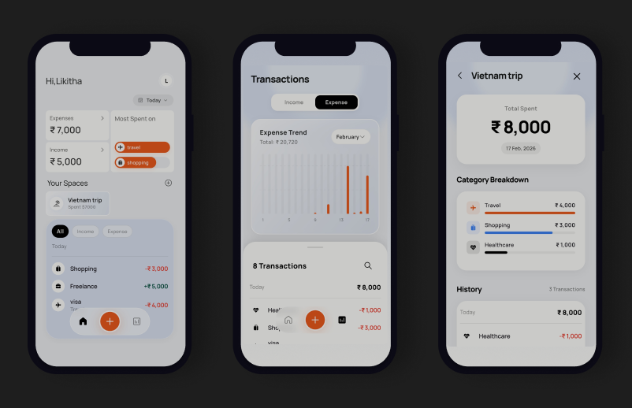

# PaisaLogr

A beautifully designed **personal finance tracker** built with Flutter, helping users take control of their daily spending and income with ease.

[**Download App**](http://localhost:3000/appGallery/paisa-logr)

---

##  What It Does

Paisa Logr lets users **log, categorize, and visualize** their financial transactions, all from their phone. It's designed to be simple enough for everyday use while providing meaningful insights into spending habits.

## Key Features

- **Transaction Logging** : Quickly add income or expense entries with amount, category, and optional notes.
- **Category System** : Organize transactions into categories (e.g., Food, Transport, Salary) with custom icons.
- **Spaces** : Group transactions into "Spaces" (like wallets, projects, or budgets) for focused tracking.
- **Income/Expense Summary** : At-a-glance daily/monthly summary card showing totals, top categories, and balance.
- **Visual Analytics** : Horizontal bar charts showing category-wise spending breakdowns within each Space.
- **Transaction History** : Grouped by date ("Today", "Yesterday", etc.) with smooth animations and filtering.
- **Multi-Currency Support** : Supports USD, EUR, GBP, INR, JPY, and many more.
- **Profile Settings** : Personalized greeting, initials badge, name and currency management.
- **Feedback System** : In-app feedback form powered by EmailJS.
- **Home Widget** : Android home screen widget for quick access to wallet info.
- **Secure & Offline** : Data is stored locally using Hive.

##  Design Highlights

- **Glassmorphism** effects on profile badges and cards.
- **Smooth page transitions** and animated tab switching.
- **Google Fonts (Manrope)** for clean, modern typography.
- **Custom bottom navigation bar** with a floating "Add" button.
- **Consistent color system**.

##  Tech Stack

- **Flutter** (Dart)
- **Hive** (Local Database)
- **Provider** (State Management)
- **fl_chart** (Charts)
- **EmailJS + HTTP** (Feedback)
- **FluentUI Icons**

---

This project was built to demonstrate a premium, polished Flutter app architecture and UI design.
